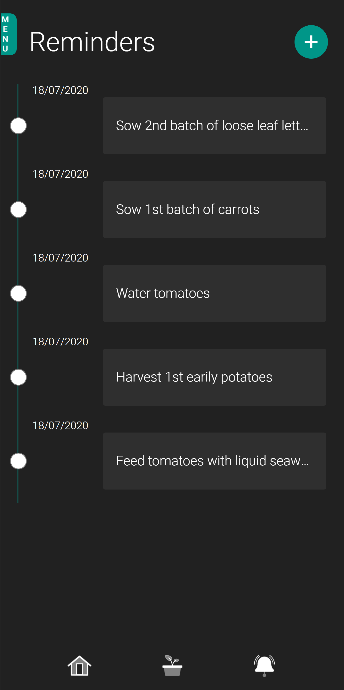

# GardenData UI Concept App
GardenData is a progressive web application which enables the user to store and monitor data throughout the growing season. This application was inspired by the increased popularity in self reliance and growing food during the covid-19 pandemic.

## Technologies used
    - React (Create react app)
    - Redux

## How to run the project?

To run the project download the project using git or as a zip file. 
        
        Then run the following commands:
        - npm install
        - npm start

## App UI

The aim was to develop a user interface which was customizable to allow the user add data which was useful to them. GardenData's UI allows the user to easily input data as they are working in the garden. 

### Login Page

### Registration Page

### Home / Dashboard Page

This is the page the user will be redirected to after successfully logging in. The purpose of this page is to display information which is retrieved from the users IoT system. The UI is simplistic to ensure the users see the most important data as quickly as possible.

### Reminder Page

### Settings Page

### Pest / Disease Page

### View Growing Data Page
